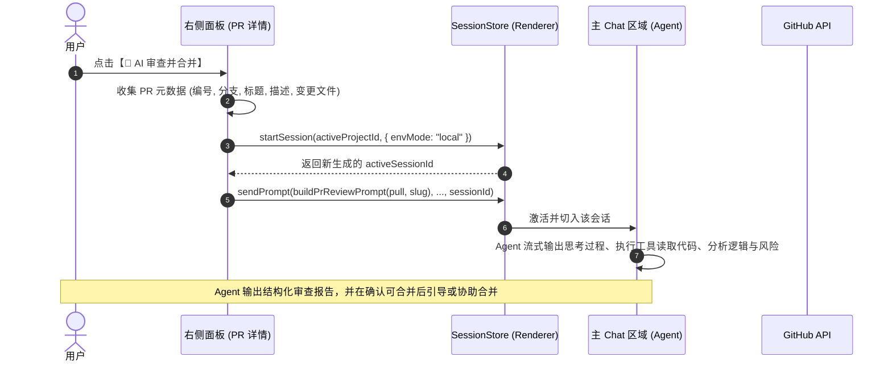
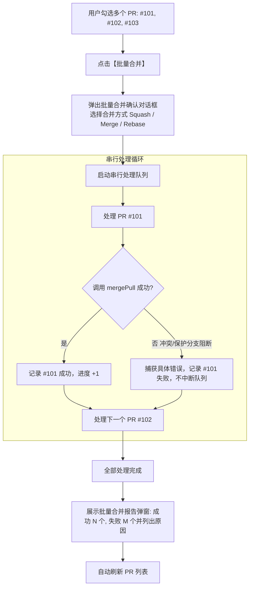

# GitHub PR 界面「AI 审查合并」与「多 PR 批量合并」实施方案

> 状态：方案设计完成，待实施  
> 归档路径：`docs/github-pr-ai-review-and-batch-merge-plan.md`

本方案旨在为右侧面板的 GitHub 标签页引入两项核心能力：
1. **AI 审查与合并会话化**：在 PR 详情页中，点击【AI 审查并合并】即可自动唤起专属 Agent 会话，在主 Chat 区域流式呈现完整的代码分析、风险评估与合并建议；
2. **多 PR 勾选批量合并**：在 PR 列表支持多选，通过严格串行队列合并已勾选 PR，具备冲突/保护分支错误隔离与进度汇总报告能力，并支持一键发起【AI 批量分析】。

---

## 一、总体架构与业务流程

### 1. 单 PR「AI 审查与合并」会话流

复用 Mcode 成熟的 `startSession + sendPrompt` 架构（与代码冲突解决工具 `MergeConflictResolveDialog` 对齐）：



### 2. 多 PR 勾选与串行批量合并流

针对 Git 依赖连锁反应（前一个 PR 合并后改变主分支基线，可能引发后续 PR 冲突），采用**严格串行队列 + 容错跳过**模式：



---

## 二、详细设计

### 1. AI 审查 Prompt 结构设计 (`buildPrReviewPrompt`)

构造带有严格角色边界与审查维度的结构化 Prompt：
```text
你是一个资深的代码审查专家与架构师。请对当前仓库的 GitHub PR 进行深入审查：
- PR: #{number} {title}
- 仓库: {owner}/{repo}
- 分支改动: {headRef} → {baseRef}
- 变更文件清单:
  - {filename} (+{additions} / -{deletions})
...

请按以下步骤执行代码审查：
1. 请调用代码读取/搜索工具，查看上述核心变更文件的具体实现；
2. 分析改动意图，评估代码质量、潜在 Bug、边界条件处理及向后兼容性；
3. 如果当前工作区处于对应仓库，可执行测试（如 npm test / tsc）验证改动有效性；
4. 输出清晰的评审结论：
   - 📝 改动总结 (Summary)
   - ⚠️ 潜在风险与安全隐患 (Risks & Issues)
   - 💡 改进建议 (Suggestions)
   - 🏁 审批结论：【建议合并】/【建议修改】/【需人工确认】
5. 若结论为【建议合并】，请告知用户合并方式建议。
```

### 2. 多 PR 批量合并交互与容错设计

1. **列表多选模式**：
   - 在 PR 列表每行左侧加入复选框（Checkbox），未选中时随鼠标悬停浮现，选中任意一项后保持常驻；
   - 列表顶部增加全选（Select All）开关及“已选 X 项”指示器；
2. **批量操作浮动工具栏 (Batch Action Bar)**：
   - 当 `selectedCount > 0` 时，在列表底部呈现浮动操作条：
     - **【批量合并 (X)】**：弹出合并确认与配置弹窗；
     - **【🤖 AI 批量分析 (X)】**：将选中的 PR 打包成一个会话任务，由 AI 评估它们之间的文件重叠与依赖关系；
     - **【取消选择】**；
3. **合并确认与执行对话框 (BatchMergeDialog)**：
   - 选项：统一指定合并方式（Squash / Merge / Rebase）、是否删除分支；
   - 进度展示：动态进度指示（如 `2 / 5 正在合并 #102...`）；
   - 结果呈现：执行完毕后清晰列出每个 PR 的执行结果（已合并 / 发生冲突跳过 / 保护分支拦截），支持一键重试失败项。

---

## 三、拟变动文件清单

### 1. 渲染进程组件与逻辑 (Renderer)
- **[`apps/desktop/src/renderer/components/github/GitHubPanel.tsx`](file:///d:/00-huangbh-project/my-claude-gui/apps/desktop/src/renderer/components/github/GitHubPanel.tsx)**
  - 在 `PullDetailView` 中：在合并操作区上方增加【🤖 开启 AI 审查并合并】按钮，实现 `handleStartAiReview`，调用 `store.startSession` 并发送审查 Prompt；
  - 在 PR 列表展示区：增加勾选状态管理 `selectedPrNumbers: Set<number>`；
  - PR 行组件增加复选框支持；
  - 增加浮动/底部批量操作栏组件 `BatchActionBar`；
  - 增加批量合并执行弹窗 `BatchMergeDialog`：负责串行循环调用 `api.github.mergePull`，记录每项成功/失败状态并提供总结报告；
  - 增加【🤖 AI 批量分析】入口：同时传入选中的多个 PR 元数据，开启综合评估会话。

### 2. 国际化文案 (i18n)
- **[`apps/desktop/src/renderer/lib/i18n/zh/github.ts`](file:///d:/00-huangbh-project/my-claude-gui/apps/desktop/src/renderer/lib/i18n/zh/github.ts) & [`en/github.ts`](file:///d:/00-huangbh-project/my-claude-gui/apps/desktop/src/renderer/lib/i18n/en/github.ts)**
  - 增加对应中文与英文词条：
    - `github.aiReviewAndMerge`: "开启 AI 审查并合并"
    - `github.batchMerge`: "批量合并"
    - `github.batchAiReview`: "AI 批量分析"
    - `github.selectedCount`: "已选择 {n} 项"
    - `github.selectAll`: "全选"
    - `github.batchMergeProgress`: "正在合并 ({current}/{total})：PR #{n}…"
    - `github.batchMergeResult`: "批量合并完成：成功 {success} 个，失败 {failed} 个"
    - 失败原因说明等。

---

## 四、验证计划

1. **类型检查**：
   - 运行 `pnpm typecheck`，确保全仓无类型错误。
2. **单 PR AI 审查会话验证**：
   - 进入某个 PR 详情页，点击【AI 审查并合并】；
   - 验证是否即时创建并切入新的会话窗口，主区开始流式输出 Agent 对该 PR 的思考与代码审查内容；
   - 验证 Agent 能否使用工具读取该 PR 相关文件的改动。
3. **多 PR 批量合并验证**：
   - 在 PR 列表多选 2~3 个 PR；
   - 执行批量合并，观察是否严格串行执行并显示实时进度；
   - 验证发生冲突或被保护分支阻断时，是否能够安全跳过并继续处理后续 PR，且在报告弹窗中清晰给出原因。
